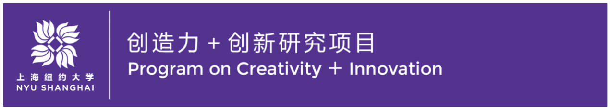
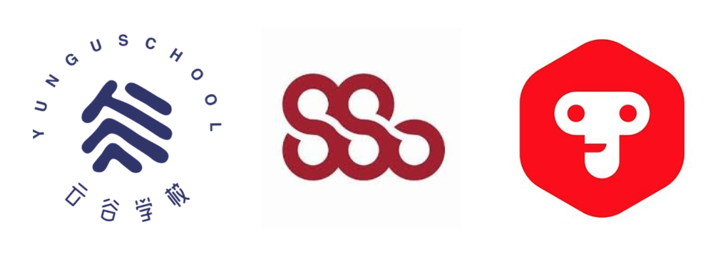

The market for creative educational experiences in after school settings for youth in China is exploding. For-profit educational service companies are competing and searching for differentiated, learning experiences in music, coding, and creative project based learning that will attract high-paying parents looking for the best supplemental education for their children. This practical, hands-on course will explore questions such as: How can we design engaging, creative learning experiences that are relevant to the cultural goals and needs of today’s youth in China, while laying the foundation for creative learning for the workforce of tomorrow? What are engaging, effective creative learning resources, and how are they best implemented in Chinese learning settings? How can we take advantage of young people’s near ubiquitous love of music and technology to facilitate creative learning?

{:.retina2x}

In this course, students will work in teams to design digital learning resources and experience designs at the intersection of music, coding, arts, and technology. The course will begin with an introduction to emerging trends in learner engagement and design-based research, especially related to web and mobile-based musical experiences and principles of making music with new media. Innovations in and applications of musical interaction, interactive technologies, user-centered design & engagement, scaffolded learning, creative learning, pedagogies of play and making, and educational entrepreneurship will also be explored.

**[View the full course syllabus.](https://drive.google.com/open?id=1DeYz2yeA0HDEUjjbhqJPHo615dT1Kt7AE9moUtgef5I){:target="_blank"}**

# Course Partners
{:.retina2x}
* [Yungu Cloud Valley School](http://yungu.org/Information/En/index){:target="_blank"}
* [Shanghai Symphony Orchestra](http://www.shsymphony.com){:target="_blank"}
* [Tinkamo](https://www.tinkamo.com){:target="_blank"}
